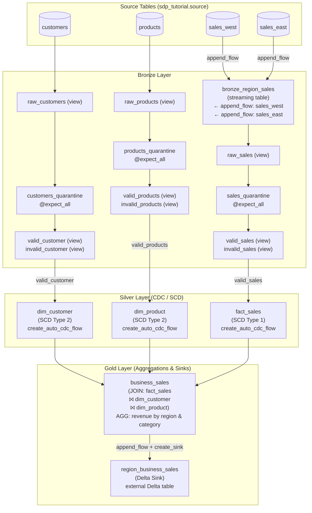

# Lakeflow Spark Declarative Pipelines (SDP) — Tutorial

A hands-on Databricks tutorial covering **Lakeflow Spark Declarative Pipelines** (`pyspark.pipelines`). The pipeline is built around a sales domain (customers, products, and regional sales data) and progresses through two implementations: a guided local version (`sdp_tutorials/`) and a GitHub-synced version (`SDP_tutorials_gh/`).

---

## Topics Covered

### 1. SDP Core Concepts
- The `pyspark.pipelines` (`dp`) decorator API
- Three dataset materialization types:
  - `@dp.materialized_view` — batch, refreshed on pipeline run
  - `@dp.table` — streaming or batch Delta table
  - `@dp.view` / `@dp.temporary_view` — logical views, not persisted to storage
- Running and previewing individual transformations vs. the full pipeline

### 2. Medallion Architecture (Bronze → Silver → Gold)
The pipeline follows a three-layer medallion architecture across all source entities.

### 3. Bronze Layer — Ingestion Patterns
- **Multi-source append flows** (`@dp.append_flow`): merging `sales_east` and `sales_west` into a single `bronze_region_sales` streaming table via `dp.create_streaming_table`
- **Data quality expectations** (`@dp.expect_all`): declarative rules on `customer_id`, `product_id`, `sale_quantity`, etc.
- **Quarantine pattern**: bad records tagged with `is_quarantined` and split into `valid_*` / `invalid_*` views for all three entities (customers, products, sales)

### 4. Silver Layer — CDC & SCD
- `dp.create_auto_cdc_flow` for applying Change Data Capture from validated Bronze views into Silver dimension/fact tables:
  - `dim_customer` — **SCD Type 2** (full history tracked via `last_updated`)
  - `dim_product` — **SCD Type 2**
  - `fact_sales` — **SCD Type 1** (upsert, keyed on `sales_id`, `customer_id`, `product_id`)

### 5. Gold Layer — Aggregations & Sinks
- **Multi-table join** (`fact_sales` ⨝ `dim_customer` ⨝ `dim_product`) to produce `business_sales`
- **Revenue aggregation** grouped by `region` and `product_category`
- **Delta Sink** (`dp.create_sink`): writing the aggregated output to an external Delta table (`workspace.default.region_business_sales`) using `@dp.append_flow`
- **SQL materialized views** (`CREATE MATERIALIZED VIEW`) as an alternative to Python definitions

### 6. Exploratory Notebooks
- Ad-hoc exploratory notebooks (not executed as part of the pipeline) for querying materialized pipeline outputs
- Shows both `spark.sql(...)` and `spark.read.table(...)` patterns

---

## Architecture Diagram



---

## Folder Structure

```
lakeflow_declarative_pipeline/
├── sdp_tutorials/              # Local Databricks pipeline source
│   ├── explorations/           # Ad-hoc notebooks (not part of pipeline run)
│   │   ├── 1_initial_sdp.py    # Intro: materialized_view, table, view decorators
│   │   ├── 2_initial_pipeline.py # Intro: Bronze→Silver→Gold mini pipeline
│   │   └── sample_exploration.py # Querying pipeline outputs interactively
│   └── src/
│       ├── bronze/
│       │   ├── ingestion_customers.py  # Quarantine pattern for customers
│       │   ├── ingestion_products.py   # Quarantine pattern for products
│       │   ├── ingestion_sales.py      # append_flow multi-source ingestion
│       │   └── valid_sales.py          # Quarantine pattern for sales
│       ├── silver/
│       │   ├── dim_customer.py         # SCD Type 2 via create_auto_cdc_flow
│       │   ├── dim_products.py         # SCD Type 2 via create_auto_cdc_flow
│       │   └── fact_sales.py           # SCD Type 1 via create_auto_cdc_flow
│       └── gold/
│           ├── region_sales.py         # 3-way join + revenue aggregation
│           ├── delta_sink.py           # create_sink to external Delta table
│           └── business_sales_test.sql # SQL-based materialized view example
│
├── SDP_tutorials_gh/           # GitHub-synced mirror of the pipeline
│   ├── explorations/           # Same intro explorations
│   └── src/                    # Same bronze/silver/gold structure
│
└── sql_source_prep/            # Source data prep notebooks (Databricks SQL)
    ├── exp_1_source_prep.dbquery.ipynb
    └── Sales_DBW_.dbquery.ipynb
```

---

## Key API Reference

| Decorator / Function | Purpose |
|---|---|
| `@dp.materialized_view` | Batch materialized view, refreshed each pipeline run |
| `@dp.table` | Persisted streaming or batch Delta table |
| `@dp.view` | Logical view (not stored); available across the pipeline |
| `@dp.temporary_view` | Inline view scoped to the current pipeline run |
| `@dp.expect_all(rules)` | Attach data quality expectations to a dataset |
| `@dp.append_flow(target=...)` | Append records from a function into a target table |
| `dp.create_streaming_table(name)` | Declare an empty streaming table as a target |
| `dp.create_auto_cdc_flow(...)` | Apply CDC changes (SCD Type 1 or 2) into a target |
| `dp.create_sink(name, format, options)` | Write pipeline output to an external store |

---

## References

- [Lakeflow Declarative Pipelines Docs](https://docs.databricks.com/ldp)
- [Python API Reference](https://docs.databricks.com/ldp/developer/python-ref)
- [Flow Examples](https://docs.databricks.com/aws/en/ldp/flow-examples)
- [Expectation / Quarantine Patterns](https://docs.databricks.com/aws/en/ldp/expectation-patterns#quarantine-invalid-records)
- [CDC / Apply Changes Reference](https://docs.databricks.com/aws/en/ldp/developer/ldp-python-ref-apply-changes)
- [Sinks](https://docs.databricks.com/aws/en/ldp/ldp-sinks)
